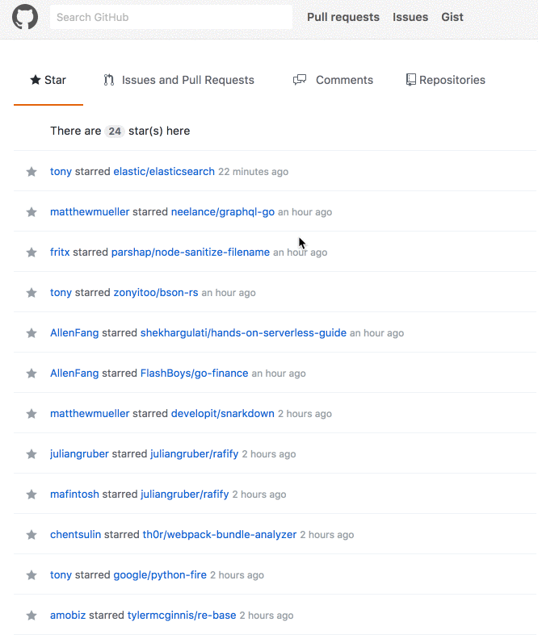

Octotab
==
  
A tiny extension for you to make github news feed organized.



How to install
==
Please download it from Google extension store.
https://chrome.google.com/webstore/detail/llfamhakdognknlckipgfkmikollbeee

Manually install
==
Clone this project.
```sh
git clone https://github.com/lockys/octotab.git
```

1. Go to Chrome setting
2. Extensions
3. Load unpacked extension.  
4. Select the folder you just cloned.

Contribute
==
File bugs, issue and PRs are always welcome.

LICENSE
==
See [LICENSE](LICENSE) File.
